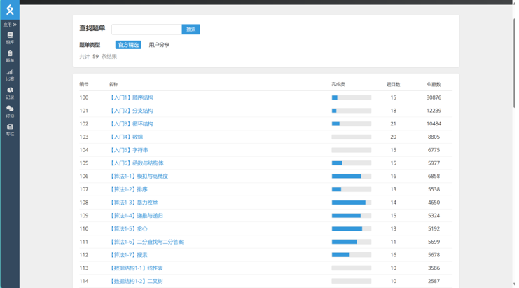

# 程序设计I

## 为什么上这门课？  

作为计算机专业的学生，编程能力是基本功，在C语言课程中打下的坚实编程功底可以帮助我们之后快速的上手任何一门语言，以及快速的通过编程解决各种难题，是内功的修炼。
本门课程课程平日有许多上机作业，这些作业AI已经有足够的能力完成，但是为了修炼内功大家还是需要花足够多的时间自己认真的写代码、debug，一味的依赖AI的coding会导致不牢。
这门课也将会带着你开启专业课的大门。

## 资源  
1.经典教材c primer plus，思路清晰，内容完备，层序递进，例子和知识交错排列，极其适合新手入门。（请远离谭浩强C语言，误人子弟！）
2.b站翁恺老师的课程深入浅出，有底层实现的讲解，不懂语法的可以去看。
3.了解完语法之后一定要多写，把更多的时间投入到coding中，可以参考洛谷的官方题单进行加练，算法1部分难度适中，时候新手。[链接](https://www.luogu.com.cn/)

## 复习资料及应试策略
大一的编程考试主要考编程的熟练度，分为选择题和实验题，选择题内容与PPT和平时的选择题高度相关，实验题中会出现平时较难的作业题。因此在备考上，对于选择题，可以在考前把所有PPT、选择题过一遍。对于实验题，平时作业一定要保证自己能在不用ai的情况下做对，同时辅以洛谷、letcode进行算法题加练。

## 拓展
1. 编程能力是进入计算机专业学习的基础，对编程有兴趣的同学可以在大一参加编程竞赛，通过更多的算法题锤炼自己的编程能力，
2. 一个优秀的计算机专业的同学应该在大一期间入门更多的编程基础，并理解、学会更多的工具。这里推荐浙大博客[谈谈如何让自己看上去、闻起来都像一个CS人](https://turing2022.tonycrane.cc/cser/)
3. 想更多的提升自己的计算机相关能力，了解更多的知识和技能，可以观看视频[前瞻：通往pro的第一步](https://www.bilibili.com/video/BV1t34y1g7YU/?share_source=copy_web&vd_source=ae4299f8720e60d7b7b06b35dd780aaf)，可以打开新世界的大门

