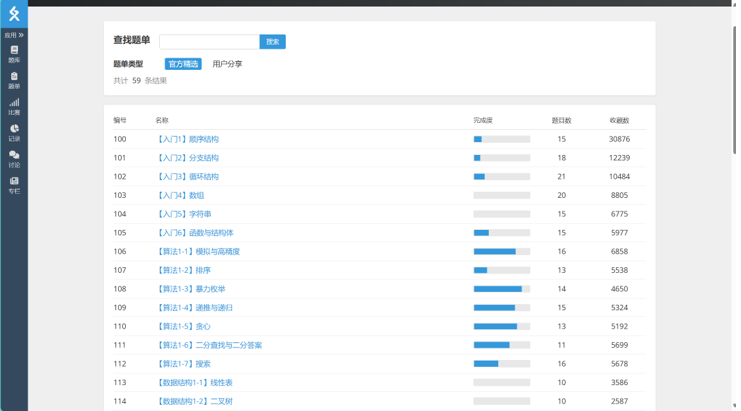
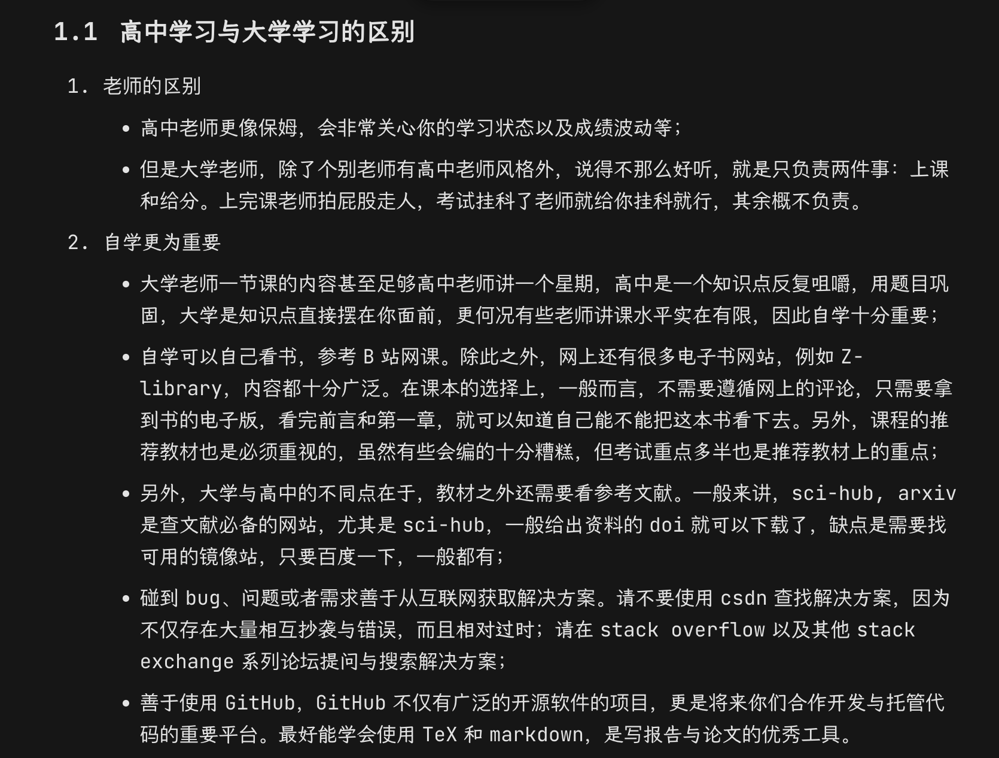
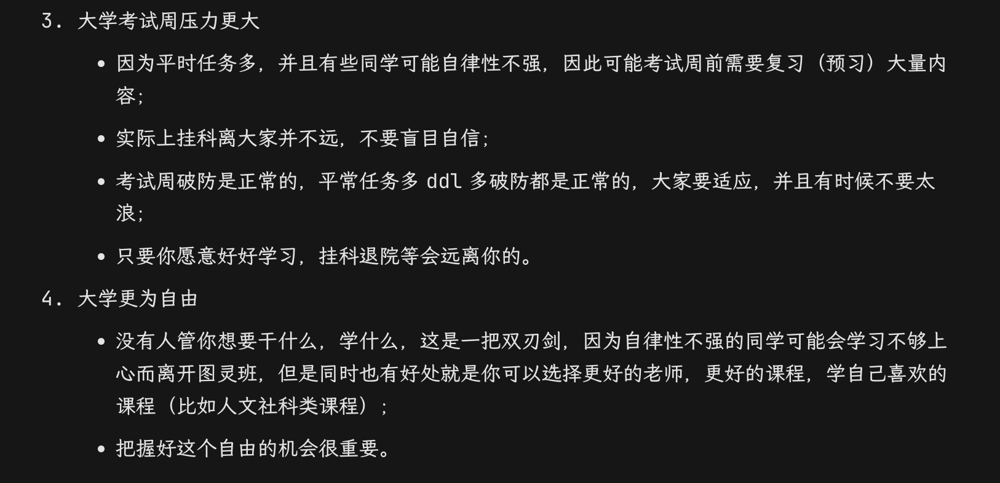

# 程序设计I

## 为什么上这门课？  

作为计算机专业的学生，编程能力是基本功，在学习C语言过程中打下的坚实编程功底可以帮助我们之后快速的上手任何一门语言，以及快速的通过编程解决各种问题，是内功的修炼。这门课将会带着你开启专业课的大门。

## 课内学习
1. 经典教材c primer plus，思路清晰，内容完备，层序递进，例子和知识交错排列，极其适合新手入门。（请远离谭浩强C语言，误人子弟！）
2. b站翁恺老师的课程深入浅出，有底层实现的讲解，可用于语法学习。[链接](https://www.bilibili.com/video/BV1dr4y1n7vA/?share_source=copy_web&vd_source=ae4299f8720e60d7b7b06b35dd780aaf)
3. 学习语法只是学习编程的第一步，对于入门新手，学习编程最重要的就是要多写多练习，把更多的时间投入到coding中
      1. 练习资源：洛谷的官方题单进行加练，算法1部分难度适中，时候新手。[链接](https://www.luogu.com.cn/)
    
4. 初步编程能力的养成不只需要对语法熟练掌握，还要提升debug能力、提升代码的可读性，后面这部分在初期我们可以借助大语言模型进行提升。比如每次通过一道题目之后都将代码复制给LLM，问问他有没有什么可以改进的地方，有什么写的不好的地方，每次写完都进行一个反思过程，会快速提高编程能力。
5. 注：本门课程课程平日有许多上机作业，这些作业AI已经有足够的能力完成，但是为了修炼内功大家还是需要花足够多的时间自己认真的写代码、debug，一味的依赖AI的coding会导致不牢。

## 初入大学之技术力养成
* 本小节主要借鉴了互联网优质开源项目以及浙大图灵优质导学资源，浙大图灵导学资源：[浙大图灵学长组文档](https://github.com/ZJU-Turing/TuringDoneRight),[浙大图灵学习指南](https://zju-turing.github.io/TuringCourses/)

---
1. 对于有兴趣广泛的自学的同学，可阅读经典项目[CS自学指南](https://csdiy.wiki/)。想更多的提升自己的计算机相关能力，了解更多的知识和技能，可阅读浙大CS博客[谈谈如何让自己看上去、闻起来都像一个CS人](https://turing2022.tonycrane.cc/cser/)，也可观看浙大CS导学视频[前瞻：通往pro的第一步](https://www.bilibili.com/video/BV1t34y1g7YU/?share_source=copy_web&vd_source=ae4299f8720e60d7b7b06b35dd780aaf)，可以打开新世界的大门。

2. 一个优秀的计算机专业的同学应该在大一期间入门更多的编程基础，广泛的理解主流的编程思想，并学会更多的工具，这对未来的科研/开发都极其重要。这里推荐著名课程：[MIT-Missing-Semester](https://csdiy.wiki/%E7%BC%96%E7%A8%8B%E5%85%A5%E9%97%A8/MIT-Missing-Semester/)

3. 对于大学的学习思路转变，这里贴一份来自“浙大图灵2024学长组资料汇总/课程学习建议”的资料
   1. 
   2. 

4. 也欢迎各位大一同学观摩本网站其他本院课程介绍，获得一定的指引。

## 复习资料及应试策略

大一的编程考试主要考察对基础语法的掌握程度（理论）和编程的熟练度（实验），分为选择题和实验题，选择题内容主要考察基础的语法知识点与PPT和平时的选择题高度相关，实验题中会出现平时较难的作业题。因此在备考上，对于选择题，可以在考前把所有PPT、选择题过一遍。对于实验题，平时作业一定要保证自己能在不用ai的情况下做对，同时辅以洛谷、letcode进行算法题加练。

## 拓展
1. 编程能力是进入计算机专业学习的基础，对编程有兴趣的同学可以在大一参加编程竞赛，编程竞赛会更多的涉及到算法题，参赛者可通过更多的算法题锤炼自己的编程能力。我校的编程竞赛参与主要由计算机学院ACMM社组织，可关注公众号：“程序设计与算法实验室”。对于算法的自学，可参考本网站：大二上-数据结构与算法。

